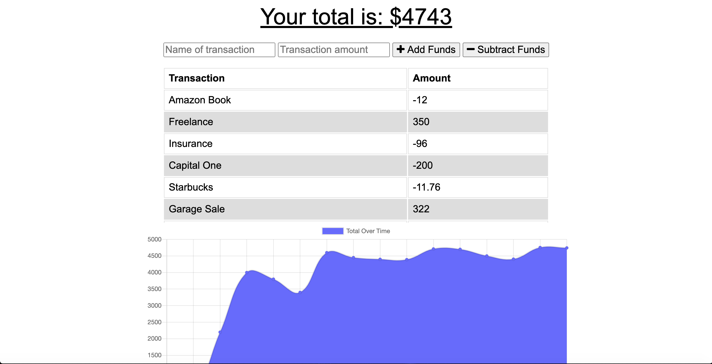

# Budget Tracker

  ## Table of Content
  -[Description](#description)
  -[Technologies](#technologies)
  -[Usage](#usage)
  -[DEMO](#demo)

## Description
The following application is a budget tracker that allows for offline access and functionality. Users are be able to add expenses and deposits to their budget with or without a connection. Having offline functionality is paramount to this applications success.

## Technologies
This application uses the following: service-worker.js, manifest, IndexedDB, npm, and Heroku.

## Usage
Deployed using Heroku

## Demo
